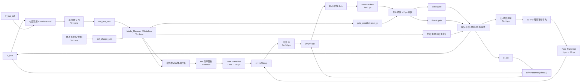

# 储能双向 DC-DC 双环与开关协调控制算法——架构规格

## 状态：历史设计草案

> 本文件保留早期控制器设计思路，不代表当前实现完成度；当前模型角色、结果和限制以根 README 与 `docs/PROJECT_STATUS.md` 为准。

**最后更新：** 2026-07-23
**父规格：** [系统规格](energy-storage-dual-loop-supervisor-system.md)

---

## 1. 架构概览

目标架构由五个职责清晰的部分组成：

1. 测量与速率转换；
2. 电压外环/充电 CC-CV 参考生成；
3. Stateflow 模式和开关协调；
4. 电流内环与占空比生成；
5. PWM、死区和功率器件驱动。

状态机不产生 PWM。快速电流环不直接控制母线接触器。所有危险执行器命令最终都要经过 Stateflow 的模式许可和故障仲裁。

---

## 2. 设计约束

| ID | 约束 |
|---|---|
| C1 | powergui 固定离散步长为 1 μs |
| C2 | PWM 频率 20 kHz，PWM 周期 50 μs |
| C3 | 电流 PI 周期 50 μs，电压 PI 与 Stateflow 周期 1 ms |
| C4 | 电感电流正方向定义为母线到电池，即充电为正、放电为负 |
| C5 | Buck/Boost 使用同步互补 PWM，功率方向由电流参考符号决定 |
| C6 | 主开关只允许在 `gate_enable=0` 且电流满足零流判据后改变 |
| C7 | 直流隔离开关使用 DC Ideal Switch/接触器模型，不使用等待交流过零的 Breaker |

---

## 3. 功能分解



---

## 4. 端到端控制链

### 4.1 母线电压外环

符号约定：

```text
eV[k] = V_bus[k] - V_bus_ref
```

该极性满足：

- `V_bus > V_ref`：产生正电流参考，电池吸收能量，降低母线电压。
- `V_bus < V_ref`：产生负电流参考，电池向母线放电，提高母线电压。

离散控制律：

```text
uV_unsat[k] = Kpv * eV[k] + xV[k]
Iref_bus_raw[k] = sat(uV_unsat[k], -5 A, 5 A)
xV[k+1] = xV[k] + TsV * (Kiv*eV[k] + anti_windup_term)
```

当前参数：

| 参数 | 值 |
|---|---:|
| `Kpv` | 0.8 |
| `Kiv` | 2.0 |
| `TsV` | 1 ms |
| 输出限制 | `[-5,5] A` |
| 积分方法 | Forward Euler |
| 防饱和 | Back-calculation |
| 外部复位 | Rising edge |

### 4.2 充电参考生成

400 V 理想源接入时，母线电压被源钳位，单独依靠母线电压环不能保证获得目标充电电流。目标架构将充电参考独立为：

```text
Iref_charge_raw =
    min(I_CC_cmd, I_CV_limit, I_charge_max)
```

其中：

- 恒流区：`I_CC_cmd` 决定充电电流；
- 恒压区：电池电压 PI 逐步降低允许充电电流；
- 任何保护限制均可进一步降低该参考；
- 充电参考不允许为负。

第一阶段若暂不实现 CC/CV，可把 `Iref_charge_raw` 作为上层可标定输入，但不得继续依靠被 400 V 源钳位的母线误差自动产生充电电流。

### 4.3 模式参考选择

```text
Standby/Precharge/Fault/Transition:
    Iref_target = 0

Charge:
    Iref_target = clamp(Iref_charge_raw, 0, I_charge_max)

Discharge:
    Iref_target = clamp(Iref_bus_raw, -I_discharge_max, 0)
```

随后执行：

```text
Iref_limited = sat(Iref_target, -10 A, 10 A)
Iref_ramped  = rate_limit(Iref_limited, +200 A/s, -200 A/s)
```

由于 Stateflow 已把有效范围限制为 ±5 A，外部 ±10 A Saturation 只作为二级保护。目标实现只保留一个明确的 Iref 斜率限制器，避免重复限速造成不清晰的动态。

### 4.4 电流内环

```text
eI[n] = Iref_50us[n] - I_L_avg_50us[n]
ΔD_unsat[n] = Kpi*eI[n] + xI[n]
ΔD[n] = sat(ΔD_unsat[n], -0.2, 0.2)
xI[n+1] = xI[n] + TsI*(Kii*eI[n] + anti_windup_term)
```

当前参数：

| 参数 | 值 |
|---|---:|
| `Kpi` | 0.236 |
| `Kii` | 74 |
| `TsI` | 50 μs |
| 输出限制 | `[-0.2,0.2]` |
| 积分方法 | Forward Euler |
| 防饱和 | Back-calculation |
| 外部复位 | Rising edge |

### 4.5 占空比前馈与限制

```text
Vden = max(V_bus, 1 V)
D_ff = sat(V_bat / Vden, 0, 1)
D_raw = D_ff + ΔD
D_cmd = sat(D_raw, 0, 1)
```

该前馈使理想稳态占空比接近 `V_bat/V_bus`，电流 PI 只补偿器件压降、负载变化和模型误差。

### 4.6 PWM 与门极

当前 PWM 参数：

```text
Fsw = 20 kHz
Ts_pwm = 1 μs
```

同步互补门极：

```text
gate_buck =
    gate_enable
    AND pwm
    AND delay(pwm, 2 μs)

gate_boost =
    gate_enable
    AND NOT(pwm)
    AND delay(NOT(pwm), 2 μs)
```

规范要求：

1. `gate_buck && gate_boost` 永远为 0。
2. `gate_enable=0` 时两个门极在一个 PWM 计算步内归零。
3. Stateflow 不得绕过该互锁直接驱动门极。

---

## 5. 组件目录

| 组件 | 实现 | 周期 | 直接馈通 | 主要职责 |
|---|---|---:|---|---|
| `CurrentMeasurementFilter` | Moving Average + Rate Transition | 1 μs/50 μs/1 ms | 部分 | 去除 20 kHz 纹波并向内环/状态机提供平均电流 |
| `BusVoltageController` | Discrete PID Controller (PI) | 1 ms | 否 | 生成放电方向的母线支撑电流参考 |
| `ChargeReferenceController` | 子系统/PI | 1 ms | 否 | 生成 CC/CV 正充电参考 |
| `Mode_Manager` | Stateflow Chart | 1 ms | 状态保持 | 模式、开关、使能、复位和参考仲裁 |
| `IrefLimiter` | Saturation + Rate Limiter | 1 ms | 是 | 限制电流和变化率 |
| `CurrentController` | Discrete PID Controller (PI) | 50 μs | 否 | 计算占空比修正量 |
| `FeedforwardDuty` | 子系统 | 快速/继承 | 是 | 计算 `Vbat/Vbus` 前馈 |
| `DutyLimiter` | Saturation | 50 μs | 是 | 最终占空比限幅 |
| `PWMGenerator` | SPS PWM Generator | 1 μs | 是 | 20 kHz PWM |
| `GateInterlock` | Logic + Delay | 1/2 μs | 部分 | 互补门极和死区 |
| `BusSwitchCoordinator` | Stateflow 输出 | 1 ms | 状态保持 | 主开关/预充开关互锁 |

---

## 6. 多速率和代数环防护

| 源速率 | 目标速率 | 信号 | 处理 |
|---:|---:|---|---|
| 1 μs | 50 μs | `I_L_avg` | Rate Transition，数据完整性开启 |
| 50 μs | 1 ms | `I_L_avg`/诊断量 | Rate Transition 或确定性抽取 |
| 1 ms | 50 μs | `Iref_target` | Rate Transition，保持一个外环周期内的参考 |
| 1 ms | 1 μs | `gate_enable` | 零阶保持；门极逻辑在快速率执行 |

要求：

- Stateflow 输出采用 Moore 风格：输出主要由当前状态决定。
- 电压 PI、电流 PI、Delay/Rate Transition 均提供离散状态，闭环不得形成全直接馈通路径。
- Rate Transition 的初值统一为 0，启动时不会产生非零电流或门极命令。

---

## 7. 积分器管理与无扰切换

| 场景 | 电压 PI | 电流 PI |
|---|---|---|
| Standby | 复位/冻结 | 复位/冻结 |
| Precharge | 复位/冻结 | 复位/冻结 |
| 进入 Charge | 充电 CC/CV 外环预装或从 0 启动 | 从 `D_ff` 对应零修正启动 |
| 进入 Discharge | 母线外环从当前 `Iref=0` 无扰启用 | 从 `D_ff` 对应零修正启动 |
| Transition | 冻结外环；电流环允许把电流调零 | 电流归零后复位 |
| Fault | 复位/冻结 | 复位/冻结 |

`reset_pi` 应为状态进入时的一个监督周期脉冲。若 PID 只配置为 rising-edge reset，则还应通过 Enabled/Tracking 结构保证 `gate_enable=0` 时积分器不会继续累积。

---

## 8. 开关协调架构

安全优先级：

```text
trip
  > 开关反馈不一致/预充超时
  > 许可撤销
  > mode_cmd 变化
  > 正常稳态控制
```

硬互锁：

```text
NOT(main_bus_switch_cmd AND precharge_bus_switch_cmd)
```

主开关命令改变的前置条件：

```text
gate_enable == false
AND abs(I_L_avg) < I_zero
AND zero_current_condition 已保持 T_zero_hold
```

充电闭合主开关还必须满足：

```text
abs(V_source - V_bus) <= V_precharge_tol
AND precharge_condition 已保持 T_precharge_stable
```

---

## 9. 关键架构决策

| # | 决策 | 选择 | 理由 |
|---|---|---|---|
| D1 | 功率方向实现 | 同步互补 PWM，改变 `Iref` 符号 | 不需要按充/放电重构门极拓扑 |
| D2 | 主开关控制位置 | Stateflow | 可与状态、故障、零流和预充统一仲裁 |
| D3 | PWM 控制位置 | Simulink 快速链路 | Stateflow 1 ms 不适合 20 kHz PWM |
| D4 | 直流隔离器件 | DC Ideal Switch/接触器模型 | 传统 Breaker 等待过零，直流下可能无法断开 |
| D5 | 充电外环 | 电池 CC/CV 或显式充电参考 | 理想 400 V 源钳位母线时母线 PI 无法主动充电 |
| D6 | 过渡状态 | 分为 C2D 和 D2C | 两个方向的开关顺序不同 |

---

## 10. 已知限制

- 当前模型没有完整的“预充电阻＋预充开关＋反馈”链路；Stateflow 输出存在但未接到执行器。
- 当前 `mode_id` 和 `mode_cmd` 使用 `double`；量产设计应改为枚举或 `uint8`。
- 当前两个 Iref Rate Limiter 可能形成重复限速，应在实现阶段确认并合并。
- 现有 Ideal Switch 块未接线；本规格不自动决定其物理接点方向。

---

## 附录 A：关联文档

- [系统规格](energy-storage-dual-loop-supervisor-system.md)
- [Stateflow 详细规格](energy-storage-dual-loop-supervisor-stateflow-detailed-spec.md)
- [实施计划](energy-storage-dual-loop-supervisor-implementation-plan.md)
- [测试计划](energy-storage-dual-loop-supervisor-test-plan.md)

## 附录 B：API 与模型核验

- `model_read` 已确认 `Mode_Manager` 当前 7 输入、7 输出、6 个状态和 14 条转移。
- Stateflow API 已确认：
  - `I_charge_max=5 A`
  - `I_discharge_cmd=5 A`
  - `I_zero=0.5 A`
  - `main_bus_switch_cmd`、`precharge_bus_switch_cmd` 已定义但未使用。
- `model_query_params` 已确认 PI、PWM、移动平均、死区和各速率参数。
- SPS Breaker 的直流限制来自 MathWorks 官方文档：
  [Breaker documentation](https://www.mathworks.com/help/sps/powersys/ref/breaker.html)
