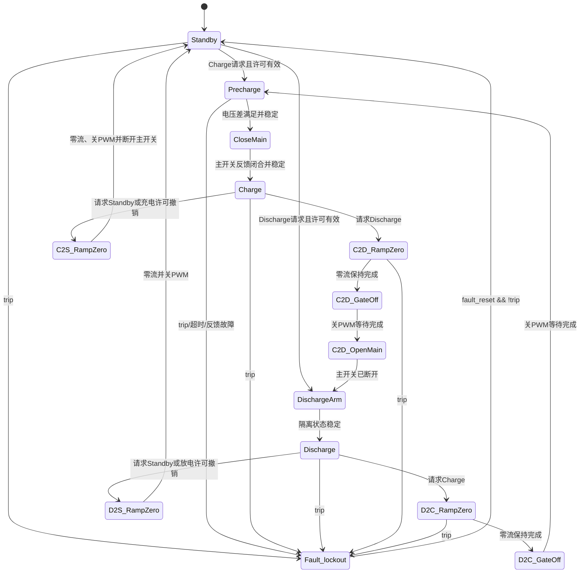

# `Mode_Manager` Stateflow 详细规格

## 状态：历史设计草案

> 本文件保留早期 Stateflow 设计思路，不代表当前实现完成度；当前模型角色、结果和限制以根 README 与 `docs/PROJECT_STATUS.md` 为准。

**最后更新：** 2026-07-23
**父规格：** [系统规格](energy-storage-dual-loop-supervisor-system.md)
**目标对象：** `main_model_fd_v05_energyprotect/Mode_Manager`（v06 延续该管理逻辑）

---

## 1. 目的

本规格定义 Stateflow 监督控制器的接口、状态、输出动作、转移守卫、时间条件和冲突仲裁。目标是使下列命令由同一个确定性状态机产生：

- `Iref_target`
- `gate_enable`
- `reset_pi`
- `main_bus_switch_cmd`
- `precharge_bus_switch_cmd`
- `mode_id`
- `transition_flag`

本规格不定义 PWM 波形，也不允许 Stateflow 直接驱动 Buck/Boost 功率管。

---

## 2. 设计原则

| 原则 | 规范 |
|---|---|
| 故障优先 | 任意状态检测到 `trip` 后优先进入 `Fault_lockout` |
| Moore 输出 | 执行器命令主要由当前状态决定，不直接由瞬时输入组合产生 |
| 零流换向 | 充放电方向改变前，电流参考归零并等待平均电感电流进入零流窗口 |
| 先关 PWM | 主开关命令变化前，必须先使 `gate_enable=0` |
| 预充闭合 | 主开关闭合前必须完成预充电压差检查 |
| 开关互斥 | 主开关和预充开关不得同时闭合 |
| 故障锁存 | `trip` 消失不会自动恢复，必须显式 `fault_reset` |
| 复位回待机 | 故障复位只返回 Standby，不自动进入故障前模式 |

---

## 3. 枚举与接口

### 3.1 模式命令

建议将 `mode_cmd` 从 `double` 改为枚举或 `uint8`：

```text
MODE_STANDBY   = 0
MODE_CHARGE    = 1
MODE_DISCHARGE = 2
```

非法值统一按 Standby 请求处理，同时置诊断标志。

### 3.2 状态输出编码

```text
STATE_STANDBY    = 0
STATE_PRECHARGE  = 1
STATE_CHARGE     = 2
STATE_DISCHARGE  = 3
STATE_TRANSITION = 4
STATE_FAULT      = 5
```

内部可使用更多子状态，但外部 `mode_id` 保持上述六类编码。

### 3.3 电流符号

```text
I_L_avg > 0：母线向电池传能，充电
I_L_avg < 0：电池向母线传能，放电
```

### 3.4 新增接口要求

| 信号 | 方向 | 类型 | 用途 |
|---|---|---|---|
| `Iref_charge_raw` | 输入 | `double` | 充电 CC/CV 正电流参考 |
| `V_bus` | 输入 | `double` | 预充判断 |
| `V_source` | 输入 | `double` | 预充判断 |
| `main_switch_fb` | 输入，可选 | `boolean` | 主开关实际状态反馈 |
| `precharge_switch_fb` | 输入，可选 | `boolean` | 预充开关实际状态反馈 |
| `fault_latched` | 输出，建议 | `boolean` | 上层诊断 |

---

## 4. 推荐状态层次



为控制状态数量，可把 `C2D_*`、`D2C_*`、`C2S_*`、`D2S_*` 作为 `Transition` 的内部子状态，外部统一输出 `mode_id=4`。

---

## 5. 状态动作规范

### 5.1 顶层输出默认值

每个周期开始时应先设置安全默认值，防止新状态漏赋值：

```text
Iref_target = 0;
gate_enable = false;
main_bus_switch_cmd = false;
precharge_bus_switch_cmd = false;
transition_flag = true;
reset_pi = false;
```

然后由活动状态覆盖必要值。所有输出必须在所有状态中有确定值。

### 5.2 状态表

| 状态 | 说明 | Entry 动作 | During 动作 | Exit 动作 |
|---|---|---|---|---|
| `Standby` | 安全待机 | `reset_pi=true` 一个周期 | `Iref=0; gate=0; main=0; pre=0; mode=0; transition=0` | 无 |
| `Precharge` | 通过预充支路使母线接近源电压 | `reset_pi=true` 一个周期并启动超时计时 | `Iref=0; gate=0; main=0; pre=1; mode=1; transition=1` | `pre=0` |
| `CloseMain` | 预充完成后闭合主开关并等待反馈 | `pre=0; main=1; gate=0` | 保持命令，等待反馈/固定稳定时间 | 无 |
| `Charge` | 正向电流充电 | 解除 PI 冻结，必要时预装积分器 | `Iref=clamp(Iref_charge_raw,0,I_charge_max); gate=1; main=1; pre=0; mode=2; transition=0` | 无 |
| `C2D_RampZero` | 充电转放电，先把电流调零 | 无 | `Iref=0; gate=1; main=1; pre=0; mode=4; transition=1` | 无 |
| `C2D_GateOff` | 电流归零后封锁门极 | `reset_pi=true` 一个周期 | `Iref=0; gate=0; main=1; pre=0; mode=4` | 无 |
| `C2D_OpenMain` | PWM 已关闭后断开源 | `main=0` | `Iref=0; gate=0; main=0; pre=0; mode=4` | 无 |
| `DischargeArm` | 确认源已隔离后准备放电 | `reset_pi=true` 一个周期 | `Iref=0; gate=0; main=0; pre=0; mode=4` | 无 |
| `Discharge` | 负电流支撑母线 | 解除 PI 冻结，外环从零参考无扰启动 | `Iref=clamp(Iref_bus_raw,-I_discharge_max,0); gate=1; main=0; pre=0; mode=3; transition=0` | 无 |
| `D2C_RampZero` | 放电转充电，先把电流调零 | 无 | `Iref=0; gate=1; main=0; pre=0; mode=4; transition=1` | 无 |
| `D2C_GateOff` | 电流归零后封锁门极 | `reset_pi=true` 一个周期 | `Iref=0; gate=0; main=0; pre=0; mode=4` | 无 |
| `C2S_RampZero` | 充电停机 | 无 | 与 `C2D_RampZero` 相同 | 电流归零后关 PWM、断主开关 |
| `D2S_RampZero` | 放电停机 | 无 | 与 `D2C_RampZero` 相同 | 电流归零后关 PWM |
| `Fault_lockout` | 故障锁存安全状态 | `reset_pi=true; fault_latched=true` | `Iref=0; gate=0; main=0; pre=0; mode=5; transition=0` | 复位时清除锁存 |

### 5.3 输出真值约束

| 约束 ID | 逻辑 |
|---|---|
| O1 | `!(main_bus_switch_cmd && precharge_bus_switch_cmd)` |
| O2 | 主开关命令发生变化时 `gate_enable == false` |
| O3 | `mode_id==2` 时 `main_bus_switch_cmd==true` |
| O4 | `mode_id==3` 时 `main_bus_switch_cmd==false`，适用于当前“断源供负载”拓扑 |
| O5 | `mode_id==5` 时所有执行器命令均为 0 |
| O6 | `gate_enable==false` 时 Buck/Boost 门极必须在快速链路中归零 |
| O7 | `transition_flag==true` 时 `mode_id` 只能为 1 或 4 |

---

## 6. 转移规格

### 6.1 全局最高优先级转移

| From | To | 条件 | 优先级 | 动作 |
|---|---|---|---:|---|
| 任意非故障状态 | `Fault_lockout` | `trip` | 1 | 清零参考、封锁门极、断开两个开关命令 |
| `Precharge`/`CloseMain` | `Fault_lockout` | 预充超时或开关反馈不一致 | 2 | 置相应诊断码 |

### 6.2 Standby 启动

| From | To | 条件 | 优先级 |
|---|---|---|---:|
| `Standby` | `Precharge` | `mode_cmd==CHARGE && charge_allowed` | 2 |
| `Standby` | `DischargeArm` | `mode_cmd==DISCHARGE && discharge_allowed` | 3 |
| `Standby` | `Standby` | 非法命令或许可无效 | 默认 |

如果充电和放电许可同时有效，以 `mode_cmd` 为唯一选择；不允许两个模式同时激活。

### 6.3 预充和主开关闭合

预充完成条件：

```text
precharge_ok =
    abs(V_source - V_bus) <= V_precharge_tol
```

转移条件：

```text
duration(precharge_ok) >= T_precharge_stable
```

| From | To | 条件 | 优先级 |
|---|---|---|---:|
| `Precharge` | `Fault_lockout` | `trip` | 1 |
| `Precharge` | `Standby` | `mode_cmd!=CHARGE || !charge_allowed` | 2 |
| `Precharge` | `Fault_lockout` | `after(T_precharge_timeout)` | 3 |
| `Precharge` | `CloseMain` | `precharge_ok` 持续满足 | 4 |
| `CloseMain` | `Fault_lockout` | 主开关反馈超时 | 2 |
| `CloseMain` | `Charge` | `main_switch_fb` 持续稳定，或仿真固定等待 `T_switch_settle` | 3 |

### 6.4 充电转放电

| From | To | 条件 | 优先级 |
|---|---|---|---:|
| `Charge` | `Fault_lockout` | `trip` | 1 |
| `Charge` | `C2S_RampZero` | `mode_cmd==STANDBY || !charge_allowed` | 2 |
| `Charge` | `C2D_RampZero` | `mode_cmd==DISCHARGE && discharge_allowed` | 3 |
| `C2D_RampZero` | `C2D_GateOff` | `duration(abs(I_L_avg)<I_zero)>=T_zero_hold` | 2 |
| `C2D_GateOff` | `C2D_OpenMain` | 已等待至少一个 Stateflow 周期 | 2 |
| `C2D_OpenMain` | `DischargeArm` | 主开关反馈断开或等待 `T_switch_settle` | 2 |
| `DischargeArm` | `Discharge` | `mode_cmd==DISCHARGE && discharge_allowed` 且隔离稳定 | 2 |

任一中间状态收到 Standby 请求，转入安全 Standby 路径；收到 Charge 请求则不得在主开关已断开后直接回 Charge，必须重新进入 Precharge。

### 6.5 放电转充电

| From | To | 条件 | 优先级 |
|---|---|---|---:|
| `Discharge` | `Fault_lockout` | `trip` | 1 |
| `Discharge` | `D2S_RampZero` | `mode_cmd==STANDBY || !discharge_allowed` | 2 |
| `Discharge` | `D2C_RampZero` | `mode_cmd==CHARGE && charge_allowed` | 3 |
| `D2C_RampZero` | `D2C_GateOff` | `duration(abs(I_L_avg)<I_zero)>=T_zero_hold` | 2 |
| `D2C_GateOff` | `Precharge` | 已等待至少一个 Stateflow 周期 | 2 |

### 6.6 故障复位

| From | To | 条件 | 优先级 | 说明 |
|---|---|---|---:|---|
| `Fault_lockout` | `Standby` | `fault_reset && !trip` | 1 | 只回待机 |

`fault_reset` 在 `trip=1` 时无效。若复位信号持续为 1，应进行上升沿或单次消费处理，防止故障反复复位。

---

## 7. 时间逻辑

| 名称 | 默认值 | 用途 |
|---|---:|---|
| `T_zero_hold` | 5 ms | 零电流稳定判据 |
| `T_switch_gate_off` | 1 ms | 封锁门极后再动作主开关 |
| `T_switch_settle` | 2 ms | 主开关动作后的稳定等待 |
| `T_precharge_stable` | 5 ms | 预充电压差稳定判据 |
| `T_precharge_timeout` | TBD | 预充失败检测 |
| `T_mode_debounce` | 可选 2～5 ms | 外部模式命令去抖 |

以 1 ms Stateflow 周期实现时：

```text
5 ms = 连续 5 次监督周期满足条件
2 ms = 连续 2 次监督周期
```

不得用未滤波的瞬时电流零交叉直接触发开关动作。

---

## 8. 仲裁规则

同一周期存在多个可用转移时，按以下顺序：

1. `trip`
2. 开关反馈故障、预充超时
3. 当前模式许可撤销
4. Standby 请求
5. 方向切换请求
6. 正常状态推进条件

转移守卫必须互斥或显式排序。禁止依赖 Stateflow 图形位置隐式决定安全相关优先级。

---

## 9. PI 复位和冻结

当前 PI 块配置为 rising-edge 外部复位。Stateflow 应输出一个周期脉冲：

```text
entry:
    reset_pi = true;

during:
    reset_pi = false;
```

需要复位的状态：

- `Standby`
- `Precharge`
- `C2D_GateOff`
- `DischargeArm`
- `D2C_GateOff`
- `Fault_lockout`

此外，PI 子系统应在 `gate_enable=0` 时冻结积分器或进入跟踪模式。仅依靠一次上升沿复位，无法防止长时间禁用期间再次积分。

---

## 10. 边界条件

| 情况 | 期望行为 |
|---|---|
| `mode_cmd` 非法 | 按 Standby 请求处理并置诊断 |
| `I_L_avg` 为 NaN/Inf | 立即进入 Fault |
| `V_bus` 或 `V_source` 无效 | 禁止预充完成，最终超时进入 Fault |
| `charge_allowed=0` | 不进入或退出 Charge |
| `discharge_allowed=0` | 不进入或退出 Discharge |
| 预充期间模式改为 Discharge | 先断开预充开关，进入 DischargeArm，不闭合主开关 |
| 方向切换期间命令反复变化 | 优先完成归零和安全隔离，再从 Standby/安全节点重新仲裁 |
| 主开关反馈与命令不一致 | 在反馈超时后进入 Fault |
| 首次执行 | 默认进入 Standby，所有执行器输出为 0 |

---

## 11. 具体示例

### 示例 A：充电转放电

初始：

```text
State=Charge
mode_cmd=CHARGE
main_bus_switch_cmd=1
gate_enable=1
I_L_avg=+3 A
```

收到 `mode_cmd=DISCHARGE`：

1. 进入 `C2D_RampZero`，主开关保持闭合，电流参考变为 0。
2. 电流内环继续工作，直到 `|I_L_avg|<0.5 A` 连续 5 ms。
3. 进入 `C2D_GateOff`，封锁 PWM 并复位 PI。
4. 至少等待 1 ms 后进入 `C2D_OpenMain`，主开关命令变为 0。
5. 确认开关断开并稳定至少 2 ms。
6. 进入 `Discharge`，启用 PWM，负电流参考从 0 按斜率限制增加。

### 示例 B：放电转充电

1. 负电流参考归零。
2. 电流进入 ±0.5 A 窗口并保持 5 ms。
3. 封锁 PWM。
4. 进入 Precharge，闭合预充开关。
5. `|V_source-V_bus|` 满足阈值并保持 5 ms。
6. 断开预充开关，闭合主开关，等待反馈稳定。
7. 进入 Charge，正电流参考按斜率限制增加。

### 示例 C：故障

任意活动状态 `trip=1`：

```text
下一次 1 ms Stateflow 执行：
Iref_target=0
gate_enable=0
main_bus_switch_cmd=0
precharge_bus_switch_cmd=0
mode_id=5
fault_latched=1
```

---

## 12. 实现检查清单

- [ ] 两个新增开关输出在所有状态中均被显式赋值。
- [ ] Stateflow 编译不再报告未使用的开关输出。
- [ ] 每个非故障状态都有 `trip` 最高优先级转移。
- [ ] C2D 和 D2C 使用不同内部路径。
- [ ] 主开关命令变化前至少一个周期 `gate_enable=0`。
- [ ] 预充完成使用电压差和持续时间，不只使用固定延时。
- [ ] 预充具有超时故障。
- [ ] 故障复位只回 Standby。
- [ ] 所有状态均设置 `Iref_target`、`gate_enable`、两个开关命令和 `mode_id`。
- [ ] 输出命令不存在主开关与预充开关同时为 1 的组合。

---

## 附录 A：当前图与目标图差异

| 当前实现 | 目标实现 |
|---|---|
| 单一 `Transition` | 方向相关的 C2D、D2C 内部子状态 |
| `Precharge` 固定等待 5 ms | 电压差稳定判据＋反馈＋超时 |
| 新开关输出未使用 | 所有状态显式赋值 |
| 主开关由外部 Step 控制 | Stateflow 统一控制 |
| `Iref_bus_raw` 同时用于充放电 | Charge 使用 CC/CV，Discharge 使用母线外环 |
| Fault 不控制外部主开关 | Fault 强制两个开关命令为 0 |
